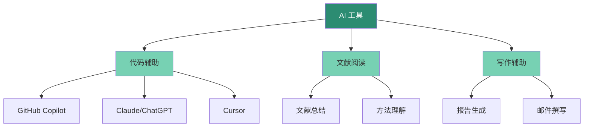

> 记录我如何用 AI 工具提升科研效率，以及踩过的坑。

---

## 为什么要用 AI 工具

做科研时经常遇到这些场景：
- 看不懂复杂的代码逻辑
- 需要快速了解一篇文献的核心内容
- 写代码时忘记某个函数的用法
- 分析结果需要写成报告，但不知道怎么组织

AI 工具可以在这些场景下节省大量时间。

---

## 我的 AI 工具箱



---

## 实际应用场景

### 1. 代码调试

**场景**：运行 RNA-seq 分析脚本时报错

```
Error in DESeqDataSetFromMatrix: some values in assay are not integers
```

**我的做法**：
1. 把错误信息和相关代码复制给 Claude
2. 询问："这个错误是什么原因？怎么解决？"
3. 得到解释：计数矩阵包含小数，需要取整

**解决方案**：
```r
counts <- round(counts)  # 将计数取整
```

---

### 2. 文献快速理解

**场景**：需要快速了解一篇 30 页的方法学论文

**我的工作流**：
1. 用 PDF 阅读器提取文本
2. 让 AI 总结：
   - 研究的核心问题是什么？
   - 用了什么方法？
   - 主要结论是什么？
3. 针对不懂的部分继续追问

**效果**：从 2 小时精读缩短到 30 分钟快速理解

---

### 3. 代码生成

**场景**：需要写一个批量处理文件的脚本

**提示词示例**：
```
我有一个目录，里面有多个 .bam 文件，
我想用 samtools 对每个文件进行排序和索引。
请帮我写一个 bash 脚本。
```

**生成的代码**：
```bash
#!/bin/bash

for bam in *.bam; do
    echo "Processing $bam..."
    samtools sort $bam -o ${bam%.bam}.sorted.bam
    samtools index ${bam%.bam}.sorted.bam
done

echo "All files processed!"
```

---

### 4. 数据可视化建议

**场景**：有一组差异表达基因数据，不知道用什么图展示

**提问**：
```
我有 RNA-seq 差异分析结果，包含 log2FoldChange 和 padj。
我想展示差异基因的分布，应该用什么图？
请给我 R 代码。
```

**得到建议**：
- 火山图（Volcano plot）
- 热图（Heatmap）
- MA plot

---

## 使用技巧

### ✅ 好的提问方式

1. **提供上下文**
   ```
   我在用 DESeq2 做差异分析，
   样本是 3 个对照组 vs 3 个处理组。
   现在遇到这个错误：...
   ```

2. **明确需求**
   ```
   请帮我写一个 Python 函数，
   输入是基因列表，输出是 GO 富集分析结果。
   使用 goatools 库。
   ```

3. **分步骤询问**
   - 先问整体思路
   - 再问具体实现
   - 最后问优化建议

---

### ❌ 不好的提问方式

1. **太模糊**
   ```
   我的代码报错了，怎么办？
   ```

2. **期望过高**
   ```
   帮我完成整个 RNA-seq 分析流程
   ```

3. **不提供信息**
   ```
   这个函数怎么用？
   （没说是什么函数）
   ```

---

## 我的使用原则

1. **AI 是助手，不是替代品**
   - 用 AI 加速理解，但核心逻辑要自己掌握
   - 生成的代码要理解后再用

2. **验证 AI 的输出**
   - 代码要测试
   - 方法要查文档确认
   - 不盲目相信

3. **保护数据隐私**
   - 不上传真实的患者数据
   - 不上传未发表的核心结果
   - 用示例数据代替

---

## 推荐工具

| 工具 | 用途 | 费用 |
|------|------|------|
| Claude | 代码理解、文献总结 | 免费/付费 |
| ChatGPT | 通用问答 | 免费/付费 |
| GitHub Copilot | 代码补全 | 学生免费 |
| Cursor | AI 编程 | 免费/付费 |

---

## 未来探索

- 用 AI 自动生成分析报告
- 训练专门的生信问答模型
- 构建个人知识库 + AI 检索

---

*最后更新：2026-03-31*
