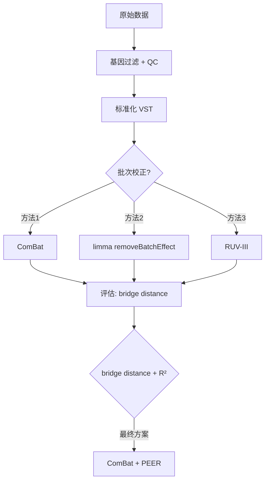

# 批次效应求生记

> 哈，真是给整无语了。

912个样本的RNA-seq数据，横跨多个发育阶段（developing / maturing / aging），分散在不同批次里做的测序。目标很朴素：把batch effect去掉，留下干净的生物学信号。

听起来是教科书级别的标准操作对吧？

错。



---

## 条件和批次完全混杂

常规批次校正的前提是batch和生物学条件独立——stage1的样本均匀分布在各个batch里，算法才能分辨"哪些差异来自batch，哪些来自biology"。

但我的数据里stage1全集中在batch1、batch2，stage2全在batch3、batch4。完全confounded。

"真是给整无语了"就是在这个时候说出来的。

---

## 桥接设计救了一命

好在数据里有一批重复测序的样本——batch9里有些样本带`_rep`后缀，是原始样本的重测。这就是bridge pair。

同一批样本分别在不同条件下测序，表达差异理论上只来自技术噪音。这给了我们一把"尺子"：在PCA空间里，bridge pair距离越小，校正越好。

没有bridge pair的话，一切评估都是自欺欺人。

```r
# bridge pair筛选
bridge_samples <- coldata %>%
  filter(str_detect(sample_id, "_rep")) %>%
  pull(original_sample)  # 找到原样本

# 计算校正前后的bridge distance
library(FNN)
get_bridge_dist <- function(expr_mat, bridge_pairs) {
  dists <- numeric(nrow(bridge_pairs))
  for (i in 1:nrow(bridge_pairs)) {
    s1 <- expr_mat[, bridge_pairs$sample1[i]]
    s2 <- expr_mat[, bridge_pairs$sample2[i]]
    dists[i] <- dist(rbind(s1, s2))
  }
  return(mean(dists))
}
```

---

## 基因过滤：别在垃圾数据上跑花式算法

> 本人还是觉得应当进行一个比较全面的基因过滤再开始。

这是整个过程中我最坚持的一点。数据还没校正之前：

```r
# 1. TPM过滤
tpm_mat <- calculate_tpm(counts, gene_lengths)
keep_tpm <- rowSums(tpm_mat > 0.1) >= ncol(counts) * 0.2

# 2. Count过滤
keep_count <- rowSums(counts >= 6) >= ncol(counts) * 0.2

# 3. 常染色体
keep_auto <- !str_detect(rownames(counts), "^chr[XYM]")

# 4. 合并
keep <- keep_tpm & keep_count & keep_auto
counts_filt <- counts[keep, ]

# 5. WGCNA离群值检测
library(WGCNA)
kME <- signedKME(expr_dat, eigengenes)
outliers <- which(apply(kME, 1, max) < 0.5)  # connectivity低的样本
```

低RIN样本（RIN < 5）也注意去掉。

正态化用TMM → log-CPM。这一步做好了后面才不会出幺蛾子。

---

## ComBat

第一个试的是sva包的ComBat。经验贝叶斯框架，对每个基因估计batch effect参数（加性+乘性），然后抹掉。

```r
library(sva)

# ComBat校正
combat_expr <- ComBat(
  dat = assay(vsd),
  batch = coldata$RNA_batch,
  mod = model.matrix(~ group, data = coldata),
  par.prior = TRUE,
  ref.batch = "batch5"  # 选样本量最多的batch做参考
)
```

PCA上看batch聚类确实松散了一些，但bridge distance改善有限。ComBat假设batch effect是线性的，而且要求"多数基因不受batch影响"——我的数据里这两个假设都存疑。

---

## limma::removeBatchEffect

就是把batch当协变量，残差当校正后的表达。快，简单。

```r
library(limma)
combat_limma <- removeBatchEffect(
  assay(vsd),
  batch = coldata$RNA_batch,
  design = model.matrix(~ group, data = coldata)
)
```

但和ComBat一样依赖线性假设，而且是design-aware的——你必须提前知道哪些是生物学变量。多阶段实验里这个假设未必成立。

---

## RUV-III：用阴性对照

RUV-III思路完全不同：不需要假设batch effect的形式，利用negative control genes来估计hidden factors。

stable genes的筛选：bridge pair之间方差最小的10%基因。

```r
library(RUVSeq)

# 筛选稳定基因（bridge pair间方差最小）
bridge_var <- apply(expr_mat[, bridge_pairs$sample1] -
                     expr_mat[, bridge_pairs$sample2], 1, var)
stable_genes <- names(sort(bridge_var))[1:(nrow(expr_mat) * 0.1)]

# RUV-III
ruv_expr <- RUVg(expr_mat, stable_genes, k = 7)  # k经过调参
```

k值从1到10都跑了一遍，control genes残余方差vs总方差，带惩罚项的综合评分选出最优k。

---

## 没有银弹

三个维度评估：

```r
# 1. Bridge distance
bridge_dist <- get_bridge_dist(corrected_expr, bridge_pairs)

# 2. Batch R² (越低越好)
batch_r2 <- summary(lm(pca$x[,1] ~ coldata$batch))$r.squared

# 3. Biology R² (越高越好)
bio_r2 <- summary(lm(pca$x[,1] ~ coldata$group))$r.squared
```

| 维度 | 含义 |
|------|------|
| bridge distance | 校正后同一原样两个测序在PCA空间有多近 |
| batch R² | PCA主成分能被batch解释的比例（越低越好）|
| biology R² | PCA主成分能被group解释的比例（越高越好）|

结果：

- **ComBat**：batch R²降得明显，bridge distance改善有限
- **limma**：快，效果和ComBat差不多
- **RUV-III**：bridge distance最小，但可能过度校正掉biology signal

最终选择：**ComBat修正技术batch + PEER因子捕获hidden confounders**。

```r
# 最终方案
# 1. VST标准化
vsd <- vst(dds, blind = TRUE)

# 2. ComBat校正技术batch
combat_expr <- ComBat(assay(vsd), batch = coldata$RNA_batch,
                       mod = model.matrix(~ group, coldata))

# 3. PEER因子 (隐藏混杂因素)
# 用PEER包跑15个因子，然后作为covariate加入下游线性模型
```

两层过滤，比单用任何一个方法都稳。

---

批次效应校正本质是在"去噪"和"保真"之间走钢丝。走多了会发现，真正重要的不是选哪个算法，而是实验设计阶段就别让batch和condition confound。

可惜这个道理，通常是撞了南墙之后才懂的。