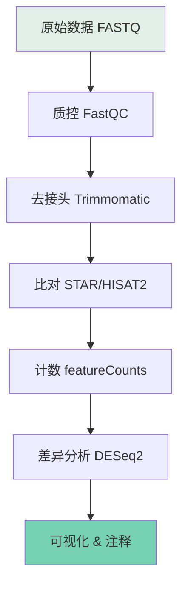

> 整理我常用的生信工具和踩过的坑，方便自己查阅，也希望能帮到其他人。

---

## RNA-seq 分析流程



### 1. 质控（FastQC）

```bash
# 批量运行 FastQC
for file in *.fastq.gz; do
    fastqc $file -o fastqc_results/
done

# 用 MultiQC 汇总结果
multiqc fastqc_results/ -o multiqc_report/
```

**常见问题**：
- Per base sequence quality 下降 → 需要 trim
- Adapter content 高 → 需要去接头

---

### 2. 去接头（Trimmomatic）

```bash
trimmomatic PE \
    input_R1.fastq.gz input_R2.fastq.gz \
    output_R1_paired.fastq.gz output_R1_unpaired.fastq.gz \
    output_R2_paired.fastq.gz output_R2_unpaired.fastq.gz \
    ILLUMINACLIP:adapters.fa:2:30:10 \
    LEADING:3 TRAILING:3 \
    SLIDINGWINDOW:4:15 MINLEN:36
```

---

### 3. 比对（STAR）

```bash
# 建索引（只需运行一次）
STAR --runMode genomeGenerate \
     --genomeDir genome_index/ \
     --genomeFastaFiles genome.fa \
     --sjdbGTFfile annotation.gtf \
     --sjdbOverhang 99

# 比对
STAR --genomeDir genome_index/ \
     --readFilesIn sample_R1.fastq.gz sample_R2.fastq.gz \
     --readFilesCommand zcat \
     --outFileNamePrefix sample_ \
     --outSAMtype BAM SortedByCoordinate
```

**我踩的坑**：
- `--sjdbOverhang` 应该设为 read length - 1
- 内存不够会报错，需要用 `--limitBAMsortRAM` 限制

---

### 4. 计数（featureCounts）

```bash
featureCounts -p -t exon -g gene_id \
    -a annotation.gtf \
    -o counts.txt \
    *.bam
```

---

### 5. 差异分析（DESeq2）

```r
library(DESeq2)

# 读取计数矩阵
counts <- read.table("counts.txt", header=TRUE, row.names=1)
counts <- counts[, 6:ncol(counts)]  # 去掉前5列元数据

# 创建样本信息
coldata <- data.frame(
  condition = c("control", "control", "treated", "treated")
)

# DESeq2 分析
dds <- DESeqDataSetFromMatrix(
  countData = counts,
  colData = coldata,
  design = ~ condition
)

dds <- DESeq(dds)
res <- results(dds)

# 筛选差异基因
sig_genes <- subset(res, padj < 0.05 & abs(log2FoldChange) > 1)
```

---

## 常用可视化

### 火山图

```r
library(ggplot2)

ggplot(as.data.frame(res), aes(x=log2FoldChange, y=-log10(padj))) +
  geom_point(aes(color=padj < 0.05 & abs(log2FoldChange) > 1)) +
  scale_color_manual(values=c("grey", "#2c8c72")) +
  theme_minimal() +
  labs(title="Volcano Plot", x="log2 Fold Change", y="-log10 padj")
```

### 热图

```r
library(pheatmap)

# 提取显著差异基因的表达量
sig_counts <- counts[rownames(sig_genes), ]
sig_counts_norm <- log2(sig_counts + 1)

pheatmap(sig_counts_norm, 
         scale="row",
         color=colorRampPalette(c("#12231b", "#fffdfa", "#2c8c72"))(50))
```

---

## 实用技巧

### 批量处理样本

```bash
# 创建样本列表
samples=(sample1 sample2 sample3)

# 循环处理
for sample in "${samples[@]}"; do
    echo "Processing $sample..."
    # 你的分析命令
done
```

### Slurm 任务提交

```bash
#!/bin/bash
#SBATCH --job-name=rnaseq
#SBATCH --nodes=1
#SBATCH --ntasks=8
#SBATCH --mem=32G
#SBATCH --time=24:00:00

# 你的分析命令
```

---

## 推荐资源

- [Biostars](https://www.biostars.org/) - 生信问答社区
- [SEQanswers](http://seqanswers.com/) - 测序技术论坛
- [Galaxy](https://usegalaxy.org/) - 在线分析平台

---

*持续更新中……*
