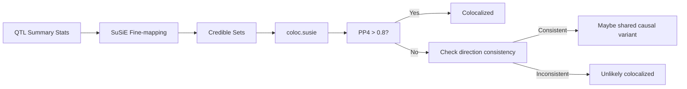

# Coloc与Fine-mapping实战

coloc和fine-mapping是QTL分析的最后一步——把遗传调控信号和疾病关联连起来。听起来很直接，实际每一步都有坑。

---

## 为什么先做fine-mapping再coloc

最常见的做法是拿GWAS summary statistics直接跑coloc。但如果你有多个ancestry group的QTL数据，直接coloc有一个大问题：LD结构不确定。

SuSiE的credible set能提供更精确的LD信息，所以先fine-mapping再coloc比直接coloc更可靠。



---

## SuSiE Fine-mapping

SuSiE（Sum of Single Effects）能给出可信的credible set，比直接用summary statistics更准确：

```r
library(susieR)

# 对每个QTL locus做fine-mapping
susie_fit <- susie_rss(
  z = z_scores,         # summary statistics的z值
  R = LD_matrix,        # LD相关矩阵
  n = sample_size,
  L = 10,               # 最多假设10个causal variant
  check_z = FALSE       # 如果LD矩阵不完美
)

# 提取credible set
cs <- susie_fit$cs
# 每个credible set有一个coverage level（默认95%）
# 和一组SNP的posterior inclusion probability (PIP)

# PIP最高的variant是每个credible set的lead SNP
lead_snps <- sapply(cs, function(x) {
  which.max(susie_fit$pip[x$variable])
})
```

关键参数：
- **L**：causal variant数上限。从L=10开始，如果只有1-2个credible set，L可以设小一些
- **check_z**：如果LD矩阵和summary statistics来自不同样本，设FALSE

坑：SuSiE对LD矩阵质量非常敏感。如果LD是从reference panel估计的（而不是样本内），结果可能不稳定。用per-ancestry的LD矩阵比用合并的更好。

---

## 多人群Fine-mapping

每个人群独立做fine-mapping，然后比较credible set是否重叠：

```r
# Per-ancestry SuSiE
susie_eas <- susie_rss(z = z_eas, R = LD_eas, n = n_eas, L = 10)
susie_eur <- susie_rss(z = z_eur, R = LD_eur, n = n_eur, L = 10)
susie_afr <- susie_rss(z = z_afr, R = LD_afr, n = n_afr, L = 10)

# 比较credible set重叠
# 如果同一个locus在不同人群有重叠的credible set，
# 说明共享causal variant的可能性更高
```

不同人群的LD分辨率不一样——AFR的LD block更短，fine-mapping精度更高。EUR的LD block长，credible set往往包含更多variant。

---

## coloc.susie()

用SuSiE结果做coloc，比直接用summary statistics更准确：

```r
library(coloc)

# 方式1：用SuSiE objects直接做coloc
result <- coloc.susie(
  susie_obj = susie_eas,   # QTL的SuSiE结果
  susie_obj2 = susie_gwas, # GWAS的SuSiE结果（如果有的话）
  p1 = n_eas,               # 样本量
  p2 = n_gwas,
  s1 = n_eas_causal,        # causal variant先验
  s2 = n_gwas_causal
)

# 方式2：如果没有GWAS的SuSiE，用summary statistics
result <- coloc.abf(
  dataset1 = list(
    pvalues = pvals_eas,
    N = n_eas,
    type = "quant",
    sdY = 1  # 标准化的表型
  ),
  dataset2 = list(
    pvalues = pvals_gwas,
    N = n_gwas,
    type = "cc",  # case-control
    s = case_ratio
  )
)
```

---

## PP4阈值怎么选

coloc输出5个假设的后验概率：

| 假设 | 含义 |
|------|------|
| PP0 | 两个locus没有关联 |
| PP1 | QTL有causal variant，GWAS没有 |
| PP2 | GWAS有causal variant，QTL没有 |
| PP3 | 两个独立的causal variant碰巧在同一个区域 |
| **PP4** | **共享causal variant** |

常规阈值是PP4 > 0.8。但实际上很多时候PP4在0.5-0.8之间——这种"灰色地带"怎么判？

我的经验：

1. **PP4 > 0.8**：colocalization比较可靠
2. **PP4 0.6-0.8**：看效应量方向是否一致。如果三个人群里QTL和GWAS的effect direction都一致，即使PP4不到0.8也值得追踪
3. **PP4 < 0.6**：大概率不是同一个variant，但如果QTL super强也可以考虑

> 姐们写这个写得真的差点和AI吵起来^^
> 头一次搓出来AI都看不出的错^^

coloc有个容易犯的错：region太宽或太窄。太宽会把无关的variant拉进来降低PP4，太窄会漏掉真正的causal variant。

```r
# 选region：lead SNP ± 500kb是通常的做法
# 但如果有fine-mapping信息，用credible set的范围更好

# 用credible set定义region
region_start <- min(susie_fit$cs[[1]]$variable) - 1e5
region_end <- max(susie_fit$cs[[1]]$variable) + 1e5
```

---

## SMR：另一个验证方式

SMR（Summary-based Mendelian Randomization）是coloc的补充验证：

```bash
# SMR分析
smr \
  --bfile reference_PLINK \
  --gwas-summary gwas_summary.txt \
  --beqtl-summary eQTL_summary \
  --out smr_results \
  --thread-num 8
```

SMR的好处是可以区分 linkage（LD造成的关联）和 pleiotropy（同一个variant影响两个trait）。HEIDI test不显著说明可能是pleiotropy，也就是真正的共享causal variant。

但SMR要求顶层eQTL是single causal variant——如果有多个causal variant，HEIDI test可能不准确。

---

## 需要注意的坑

1. **LD矩阵来源**：用样本内LD最准，但很多时候只有reference panel。不同reference panel（1000G、UKBB、ChinaMAP）给出的结果可能不一致

2. **MAF差异**：跨人群coloc时，一个variant在AFR里common但在EUR里rare，coloc结果会不稳定

3. **Region大小**：±500kb是默认，但有些LD block很长（尤其是EUR），需要看具体情况调整

4. **Multiple testing**：coloc本身不做multiple testing correction，跑完一个locus的coloc不代表整个基因组都是colocalized

5. **Effect direction一致性**：比PP4数值更重要的是效应方向在三个人群里是否一致。方向一致即使PP4不高也值得报告

---

*coloc是连接QTL和疾病的关键一步，但它只是一个统计方法。生物学解释永远要结合功能验证。*