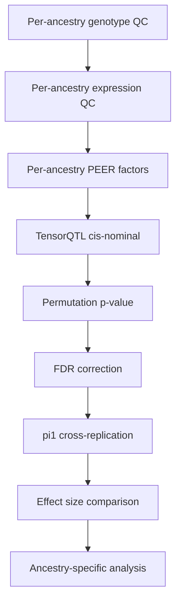

# 跨人群QTL分析

做多人群QTL最头疼的不是"怎么跑"，是"怎么比"。三个人群的样本量差一个数量级，allele frequency差异巨大，ld结构也不一样。直接比nominal p-value是没意义的。

---

## 核心问题

样本量不平衡是最大的挑战：

| 人群 | 样本数 | 特点 |
|------|--------|------|
| EUR | ~1800 | 样本量最大，power最强 |
| EAS | ~320 | 中等，东亚参考面板质量好 |
| AFR | ~247 | 最少，但变异最丰富 |

AFR样本量只有EUR的1/7，直接比significant QTL数量没有意义——power差太多了。

---

## Pipeline搭建

整个QTL mapping流程：



每个人群独立跑一遍QC和QTL mapping，PEER因子个数按样本量调整：

```r
# PEER因子个数经验公式
n_peers <- min(30, floor(n_samples / 10))
# AFR(~247): 24 factors
# EAS(~320): 30 factors
# EUR(~1800): 30 factors (上限)
```

---

## TensorQTL配置

nominal pass用TensorQTL跑，GPU加速快得多：

```python
import tensorqtl
from tensorqtl import genosio, qtl

# 加载数据（per ancestry group）
genotypes = genosio.PlinkGenotypes(plink_prefix_path)
phenotypes = pd.read_parquet(expression_parquet)
covariates = pd.read_csv(covariates_csv, index_col=0)

# cis-QTL nominal pass
cis_results = qtl.map_cis(
    genotypes=genotypes,
    phenotypes=phenotypes,
    phenotype_covariates=covariates,
    window=1e6  # 1Mb cis window
)

# pairwise mode: 每个variant-phenotype pair的p-value
```

坑：TensorQTL会自动drop掉cis window内没有valid SNP的基因（约43个），跑完之后检查一下基因数是否对得上。

---

## Permutation和significance threshold

permutation用QTLtools跑，因为它家permutation那套比较规范：

```bash
# QTLtools permutation
QTLtools \
  --ge phenomenon.parquet \
  --genotypes genotypes.parquet \
  --covariates covariates.parquet \
  --permute 1000 \
  --window 1e6 \
  --out perm_results.txt
```

每个人群单独跑permutation，单独定threshold。因为样本量不同，EUR可能1000次permutation就够了，AFR可能需要更多。

> 能说吗 我真觉得基因根本不显著

但pi1统计量在三个人群里都>0，说明共享signal是存在的。

---

## 效应量比较

不同人群的效应量是否一致？用effect size comparison来评估：

```r
# 给定一个QTL在两个群体中的beta值
compare_effects <- function(beta1, se1, beta2, se2) {
  # 方向一致性
  direction_consistent <- sign(beta1) == sign(beta2)

  # 效应量相关
  cor_test <- cor.test(beta1, beta2)

  # 异质性检验 (Cochran's Q)
  Q <- sum((beta / se)^2) - sum(beta / se^2)^2 / sum(1 / se^2)

  return(list(
    direction_consistent = direction_consistent,
    cor = cor_test$estimate,
    p = cor_test$p.value,
    Q = Q
  ))
}
```

如果效应量方向一致但大小不同，可能是power差异；如果方向不一致，可能是真正的群体差异。

---

## Population-specific QTL定义

这是最微妙的部分。简单地看"在A群体显著但在B群体不显著"是不够的——可能只是power差异。

我分了三类：

| 类别 | 定义 | 含义 |
|------|------|------|
| strict_specific | 只在一个人群显著，其他人群有power（MAF足够高）但不显著 | 可能是真的人群特异 |
| uncertain_not_tested | 其他人群MAF太低没法test | 不确定，可能是AF差异 |
| putative_low_power | 其他人群可能只是power不够 | 也许共享 |

```r
# MAF阈值：低于0.01视为没有power
# 只有人在有power的前提下不显著，才能说"shared but not significant"

classify_qtl <- function(sig_afr, sig_eas, sig_eur,
                          maf_afr, maf_eas, maf_eur,
                          maf_threshold = 0.01) {
  has_power_afr <- maf_afr >= maf_threshold
  has_power_eas <- maf_eas >= maf_threshold
  has_power_eur <- maf_eur >= maf_threshold

  # strict_specific: 只有一个人群显著，其他有power但不显著
  # uncertain_not_tested: 其他人群没有power
  # putative_low_power: 其他人群有power但不显著，但可能只是样本量不够
}
```

---

## pi1交叉验证

pi1是评估跨人群QTL共享程度的指标。值>0说明存在共享signal：

```r
library(qvalue)

# 对每个ancestry group的nominal p-values分别计算pi1
# 方向：EUR -> AFR, EAS -> AFR 等
compute_pi1 <- function(pvals_target, pvals_source) {
  # 用source的significant QTL作为index
  # 在target群体中看这些QTL是否也偏向显著
  qobj <- qvalue(pvals_target[index_snps])
  pi1 <- 1 - qobj$pi0  # >0意味着有共享signal
  return(pi1)
}

# 典型结果：
# AFR->EAS: ~0.94 (AFR的QTL在EAS里也能检测到)
# AFR->EUR: ~0.91
# EAS->AFR: ~0.59 (EAS的QTL在AFR里only部分能检测到，power不够)
# EUR->AFR: ~0.47
```

从样本量大的群体往小的验证，pi1高很正常；反过来会低，因为小群体发现QTL的地方在大群体里也可能显著。

---

## Fst分析

看 ancestry-biased QTL 的variant在不同人群间的分化程度：

```r
# 计算Fst
library(adegenet)

# AFR vs EAS
fst_afr_eas <- calculate_fst(af_afr, af_eas, n_afr, n_eas)
# AFR vs EUR
fst_afr_eur <- calculate_fst(af_afr, af_eur, n_afr, n_eur)

# Wilcoxon检验：ancestry-biased QTL的MAF是否显著不同
wilcox.test(maf_afr_biased, maf_background)
```

MAF差异显著的QTL更可能是真正的population-specific效应，而不是power差异。

---

*跨人群QTL的核心不是"怎么跑"，而是"怎么解释差异"。power不同、AF不同、LD不同——三个维度都要控制才能说"这是真正的人群特异效应"。*