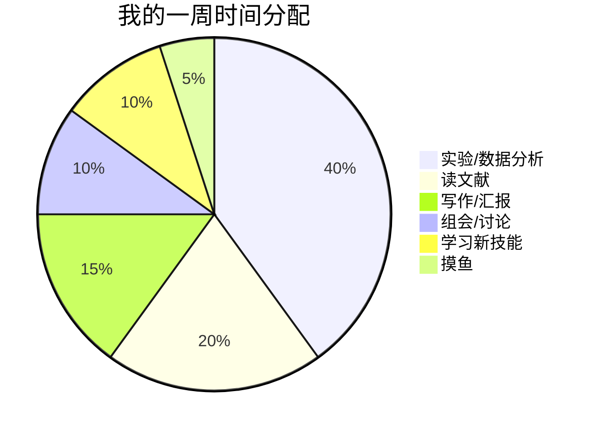

> 一些直博过程中的碎碎念和小经验。

---

## 时间管理



**我的原则**：
- 每天至少 2 小时深度工作（关掉所有通知）
- 用番茄钟：25 分钟专注 + 5 分钟休息
- 不要一直盯着屏幕，定时起来走走

---

## 文献管理

**工具**：Zotero + Better BibTeX

**我的工作流**：
1. 看到有用的文献 → 存到 Zotero
2. 读完后写 2-3 句总结在笔记里
3. 按主题打标签（#method, #review, #dataset）
4. 需要引用时直接搜索

**技巧**：
- 不要囤积文献不看
- 标题党文章可以只看摘要
- 重要文献要精读并做笔记

---

## 代码管理

```bash
# 我的项目结构
project/
├── data/           # 原始数据（不上传 git）
├── results/        # 分析结果
├── scripts/        # 分析脚本
├── notebooks/      # Jupyter notebooks
├── docs/           # 文档
└── README.md       # 项目说明
```

**版本控制**：
- 所有代码都用 Git 管理
- 每完成一个分析就 commit
- 写清楚 commit message

---

## 心态调整

### 遇到瓶颈时

1. **实验/分析不顺利**
   - 先确认是方法问题还是数据问题
   - 找师兄师姐或导师讨论
   - 换个角度思考

2. **论文被拒**
   - 正常现象，不要气馁
   - 认真看审稿意见
   - 改进后投下一个期刊

3. **进度焦虑**
   - 不要和别人比
   - 记录自己的进步
   - 适当休息很重要

---

## 效率工具

| 工具 | 用途 |
|------|------|
| Notion | 项目管理、笔记 |
| Zotero | 文献管理 |
| Obsidian | 知识库 |
| Todoist | 任务清单 |
| RescueTime | 时间追踪 |

---

## 保持健康

- 🏃 每周至少运动 3 次
- 😴 保证睡眠，不要熬夜
- 🥗 好好吃饭，少吃外卖
- 🧘 学会放松，不要一直紧绷

---

## 一些感悟

> "PhD 不是冲刺，是马拉松。"

- 不要追求完美，先完成再完美
- 多和同学交流，不要闭门造车
- 记录自己的成长，会发现其实进步很大
- 科研之外也要有生活

---

*持续更新中……*
