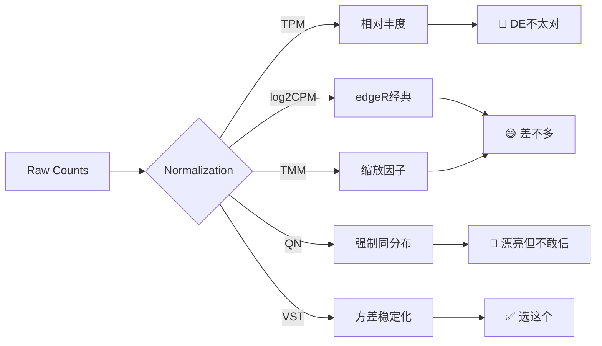

# 五种标准化方法对比实录

RNA-seq数据到手，第一件事就是：用哪种标准化？

我之前觉得这不就是选个常用方法嘛……结果真的做起来，发现远比想的纠结。

手上的数据来自不同批次，要做差异表达，还要画PCA和热图。需求很常规，光standardize这一步就卡了我好一阵。



---

## TPM

很多人第一反应就是TPM，教程里到处都是。我也试了。

```python
# TPM计算（伪代码）
tpm = (counts / gene_length) / sum(counts / gene_length) * 1e6
```

它的好处是直觉上很"公平"——每个样本TPM加起来一样，比较方便。

但TPM本来就不是为差异表达设计的。它更适合看基因的相对丰度，不是做统计检验。查了一圈文献之后开始心虚：用TPM直接跑DESeq2？好像不太对。做PCA？可以，但也不是最佳选择。

**结论：画图用TPM没问题，做DE还是算了。**

---

## log2CPM

edgeR那套里的经典操作。

```r
# log2CPM
logcpm <- cpm(counts, log = TRUE, prior.count = 1)
```

问题在于它不会特别精细地处理样本间文库大小差异，零值也只是加个小常数糊弄。出来PCA图总觉得不对——batch effect的痕迹还是很明显，又说不上是标准化的问题还是batch本身的问题。

而且说实话，log2CPM出来的图看着和TMM+log2CPM差别不大。每次我都在想这步到底在干嘛。

---

## QN (Quantile Normalization)

分位数标准化。思路很暴力：强制所有样本的表达分布一样。

```r
# QN
library(preprocessCore)
qn_expr <- normalize.quantiles(as.matrix(logcpm))
```

做microarray的时候QN效果不错，但搬到RNA-seq上水土不服。核心假设是所有样本的表达分布应该相同，但RNA-seq不一定是这样——如果你样本间真的有很大生物学差异（不同组织、不同条件），强行拉平反而会把真实信号抹掉。

我跑了，PCA图确实看起来"整洁"了不少。但——

> 姐么不带一点变好的

漂亮是漂亮，不敢信。

---

## TMM

edgeR推荐的方法。

```r
# TMM normalization
library(edgeR)
dge <- DGEList(counts = counts)
dge <- calcNormFactors(dge, method = "TMM")
tmm_cpm <- cpm(dge, log = TRUE)
```

`calcNormFactors()`一行搞定。找一组"reference genes"算样本间缩放因子，有理论支撑，用起来也简单。

TMM+log2CPM比纯log2CPM好一点，batch看起来没那么离谱了。但它本质只是个缩放因子调整，不会改变数据的分布形态。原始数据方差结构有问题的话，TMM帮不了太多。

---

## VST

DESeq2家的`vst()`。做的不只是标准化——还有方差稳定化，让低表达和高表达基因的方差趋于一致。

```r
# VST
library(DESeq2)
dds <- DESeqDataSetFromMatrix(countData = counts,
                               colData = coldata,
                               design = ~ 1)  # 不指定design，只做变换
vsd <- vst(dds, blind = TRUE)

# VST之后接ComBat
library(sva)
vsd_combat <- ComBat(dat = assay(vsd),
                      batch = coldata$batch,
                      mod = model.matrix(~ group, data = coldata))
```

> VST的效果还是相对明显一点的

PCA上组间分离更清晰，组内更紧凑。热图也是，VST之后的表达矩阵结构更干净。

关键是后面做ComBat批次校正的时候，VST出来的效果明显好于其他方法。看到那张图直接：

> ！！！怎么回事，这个看起来更好啊啊啊

老老实实说这张图我还画得真挺满意的。

---

## 最后选了 VST + ComBat

不是因为VST"碾压"了其他方法。实际五种方法差距没我想的那么大——不是仔细对比的话，哪张图都差不多。

选VST的理由更多是理论层面的：VST变换后的数据适合用线性模型，数学性质比log2CPM更适合参数检验，比QN更尊重数据本身的生物学差异，比TPM更符合DE分析的需求。

**完整流程：**

```r
# 最终pipeline
library(DESeq2); library(sva)

# 1. 基因过滤
keep <- rowSums(counts >= 6) >= ncol(counts) * 0.2  # 至少20%样本count>=6
counts_filt <- counts[keep, ]

# 2. VST
dds <- DESeqDataSetFromMatrix(counts_filt, coldata, design = ~ 1)
vsd <- vst(dds, blind = TRUE)

# 3. ComBat
vsd_combat <- ComBat(assay(vsd),
                      batch = coldata$RNA_batch,
                      mod = model.matrix(~ group, coldata))
```

还是那句话——标准化只是第一步，后面的路还长着呢。