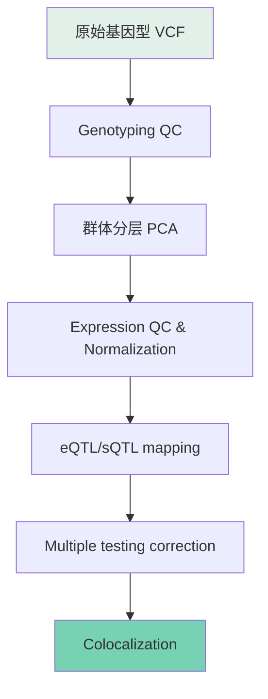

> 从零搭QTL pipeline的完整记录。不是教科书，是一个人的真实踩坑过程。
> 涉及三个ancestry group（EAS/EUR/AFR），工具对比，以及coloc前为什么要先做SuSiE。

---

## 整体流程

下面逐步展开。

---

## 1. Genotype QC：最容易翻车的一步

QC听起来很基础，但这一步出问题后面的分析全白搭。

我做的标准流程：

- **MAF filter**：去掉 minor allele frequency < 0.05 的位点
- **Missingness**：per-sample 和 per-SNP missing rate 都要查，threshold 一般设 0.02
- **HWE**：Hardy-Weinberg equilibrium test，p < 1e-6 的去掉
- **Relatedness**：用 KING 或 PLINK --genome 查 kinship，pi-hat > 0.1875 的 pairs 需要处理

### 踩过的坑：性别标注错误

这是让我印象深刻的一个QC步骤。用 X chromosome heterozygosity 检查 sample 的 reported sex 和 genetic sex 是否一致。结果真的查出来几个 sex-mislabelled 的样本——如果不是这一步，这些样本会悄悄混入 eQTL 分析，产生莫名其妙的 bias。

PLINK 的 `--check-sex` 可以快速做这个检查，F 值（inbreeding coefficient on X）偏 female 的应该接近 1，male 接近 0。看到中间值的就要仔细看。

> 经验：QC 永远不要跳过。哪怕数据看起来很 clean，跑一遍 check-sex 和 relatedness 不花多少时间。

---

## 2. Expression QC & Normalization

RNA-seq 计数拿到后：

1. 去掉低表达基因（一般 filter：CPM > 1 in at least 20% samples）
2. TMM normalization（edgeR）或直接用 rank-based inverse normal transformation（PEER / QTLtools 风格）
3. 去 hidden confounders：PEER factors 或 PCA 作为 covariates。样本量大的话 PEER 计算很慢，15-30 个 factors 通常够了
4. 按 ancestry group 分开跑——这个很重要，后面单独说

---

## 3. 工具对比：FastQTL vs QTLtools vs TensorQTL

这是我在实际跑 pipeline 时花时间最多的对比。三个工具我都用过，说说真实感受。

### FastQTL

最经典的选择，论文引用量大。用的是 linear regression，permutation pass 做 multiple testing correction（beta-approximation 方法）。

- 优点：文档清晰，结果好复现，审稿人认
- 缺点：速度一般，大数据集跑起来要好几个小时

### QTLtools

功能最全面，不只有 nominal/permutation pass，还有 mbv（matching BAM to VCF）和各种 downstream 分析。

- 优点：一个工具做很多事，permute 的实现也很稳健
- 缺点：文档偶尔跟不上版本更新

### TensorQTL

GPU加速的QTL mapping工具，速度上碾压前两个。

- 优点：真的快，尤其是跑全基因组 cis-eQTL 的时候。我用 A100 试过，速度提升大概 10-50x
- 缺点：环境配置比较挑，要 PyTorch + GPU。而且 permutation 和 FastQTL 的结果不完全一样（算法细节有差异），需要注意

### 我的选择

最后主力用的是 **QTLtools** 做 permutation，TensorQTL 做 nominal pass（需要快速拿到所有 nominal associations 的时候）。FastQTL 保留做 cross-validation——如果三个工具在同一数据集上结果不一致，那说明数据本身有问题。

---

## 4. 多群体分析：EAS/EUR/AFR 的坑

这是我遇到的最tricky的部分。

三个群体的 **allele frequency 差异巨大**。一个 variant 在 EAS 里 MAF = 0.4，在 AFR 里可能只有 0.05。这直接影响：

- **Power 不一样**：同一 variant 在不同群体里能检测到 eQTL 的概率完全不同
- **LD structure 不一样**：fine-mapping 时 lead SNP 可能不是 causal variant，LD 在 AFR 里 decay 更快，signal 更 localize
- **Coloc 的 prior 需要调整**：不同群体的 prior probability of colocalization 不同

实际操作上我选择 **按群体分开跑 QTL mapping**，而不是 meta-analysis。原因：

1. Population structure 不同，混在一起跑 PCA 会 confound
2. Effect size 的 heterogeneity 太大，fixed-effect meta-analysis 的假设不成立
3. 分开跑还能看 cross-ancestry replication——如果一个 eQTL 在三个群体里都 sig，那 confidence 很高

> 说实话，跑完之后我心里的想法是：能说吗，我真觉得基因根本不显著。有些 lead variant 的 p-value 看起来很impressive，但考虑到 multiple testing 的严格程度，很多 eQTL 其实只是 borderline significant。

---

## 5. Colocalization：SuSiE + coloc

这是pipeline的最后一环，也是我认为最容易被低估的一步。

### 为什么要先做 SuSiE fine-mapping

直接拿 eQTL 的 lead SNP 去和 GWAS 做 coloc 是不够的。原因：

- 一个 locus 可能有 **多个 independent signals**（multisignal locus）
- Lead SNP 不一定是 causal variant，coloc 结果会被 LD 污染

SuSiE（Sum of Single Effects）能做 variable selection，在 locus 内识别出多个 independent credible sets，每个 credible set 包含可能的 causal variants。

- 给 SuSiE 输入 z-scores + LD matrix
- 输出：95% credible sets，每个 set 有 PIP（posterior inclusion probability）
- 然后用这些 credible sets 和 GWAS summary stats 做 coloc

### coloc.abf vs coloc.susie

- `coloc.abf`：最经典的方法，假设一个 locus 只有一个 causal variant。快但 assumption 太强
- `coloc.susie`：利用 SuSiE 的 output，允许一个 locus 内多个 causal variants。更robust

我最终用的是 **coloc.susie**。计算量大很多，但结果明显更合理。

### PP4 threshold

一般 colocalization 用 PP4 > 0.8 作为 threshold，但这是个经验值。我的建议是结合 locus 的生物学背景来看——PP4 = 0.7 但生物学上非常 make sense 的 signal，比 PP4 = 0.85 但完全没道理的结果更值得关注。

---

## 6. 一些碎碎念

- **没我装不上的包！！** 这是我搭 pipeline 时的真实感受。从 conda 环境冲突到 C++ 依赖缺失到 Python 版本不兼容，环境配置可能是整个 pipeline 里最让人崩溃的部分。后来全切到 container 才好一点。
- Pipeline 的文档一定要写清楚。三个月后回头看自己的 code，没有注释真的会不认识。
- 每一步的中间文件都要保留。debug 的时候你会感谢自己的。
- 所有 QTL 工具都对 input 格式有严格要求（BED file 的 chromosome naming, VCF 的 sample order 等），格式不对不会报错但结果是错的。这是我踩过的最大的坑之一。

---

## 总结

| 步骤 | 主要工具 | 关键注意点 |
|---|---|---|
| Genotype QC | PLINK | sex check, relatedness, MAF |
| Expression QC | edgeR, PEER | normalization, hidden confounders |
| QTL mapping | QTLtools / TensorQTL | 多工具对比验证 |
| Fine-mapping | SuSiE | 先做再 coloc |
| Colocalization | coloc.susie | PP4 threshold 别机械套用 |

搭 pipeline 不难，难的是知道每一步在干嘛、为什么这么做。希望这篇能帮到和我一样从零开始的人。
