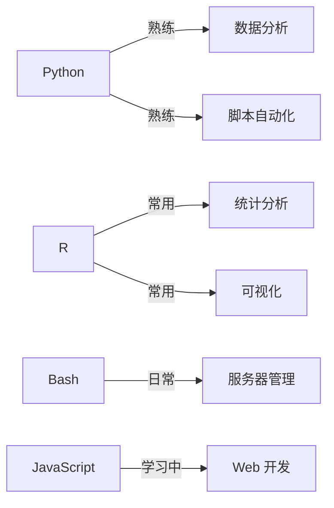
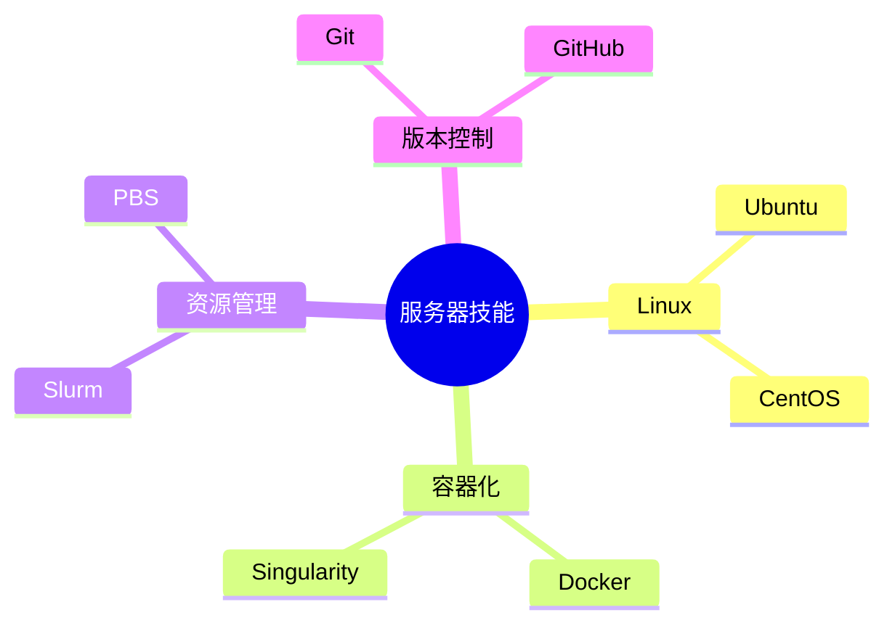
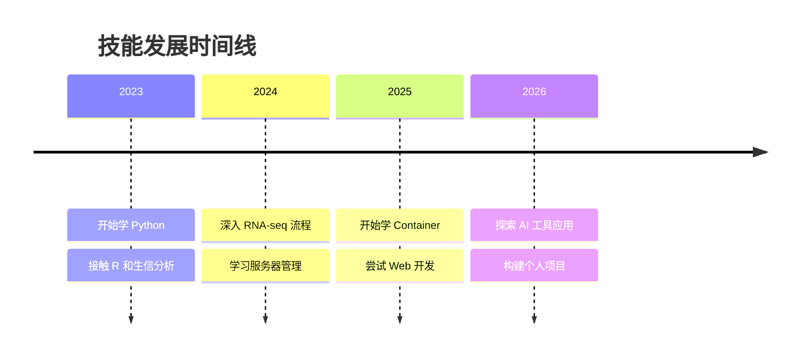

> 记录我在用和正在学的工具，持续更新。

---

## 编程语言

**Python** ⭐⭐⭐⭐  
主力语言。pandas、numpy、matplotlib 用得最多，最近在学 FastAPI。

**R** ⭐⭐⭐  
做统计和画图。ggplot2、DESeq2、Seurat 是常客。

**Bash** ⭐⭐⭐  
服务器日常操作、批处理脚本。

**JavaScript / React** ⭐⭐  
最近开始学前端，正在做 Cat Journal 项目。

---

## 生信工具

### 测序数据分析
- **STAR** / **HISAT2** - RNA-seq 比对
- **featureCounts** - 基因计数
- **DESeq2** / **edgeR** - 差异表达分析
- **BWA** / **Bowtie2** - DNA 比对
- **GATK** - 变异检测

### 可视化
- **IGV** - 基因组浏览器
- **ggplot2** - R 绘图
- **matplotlib** / **seaborn** - Python 绘图

---

## 服务器 & DevOps

**正在学习**：
- Container 技术（Docker + Singularity）
- CI/CD 基础
- Nginx 反向代理

---

## AI 工具

**日常使用**：
- Claude / ChatGPT - 代码调试、文档理解
- GitHub Copilot - 代码补全
- Cursor - AI 辅助编程

**实验中**：
- 用 LLM 辅助文献总结
- 自动化生成分析报告

---

## 学习路线

---

*最后更新：2026-03-31*
