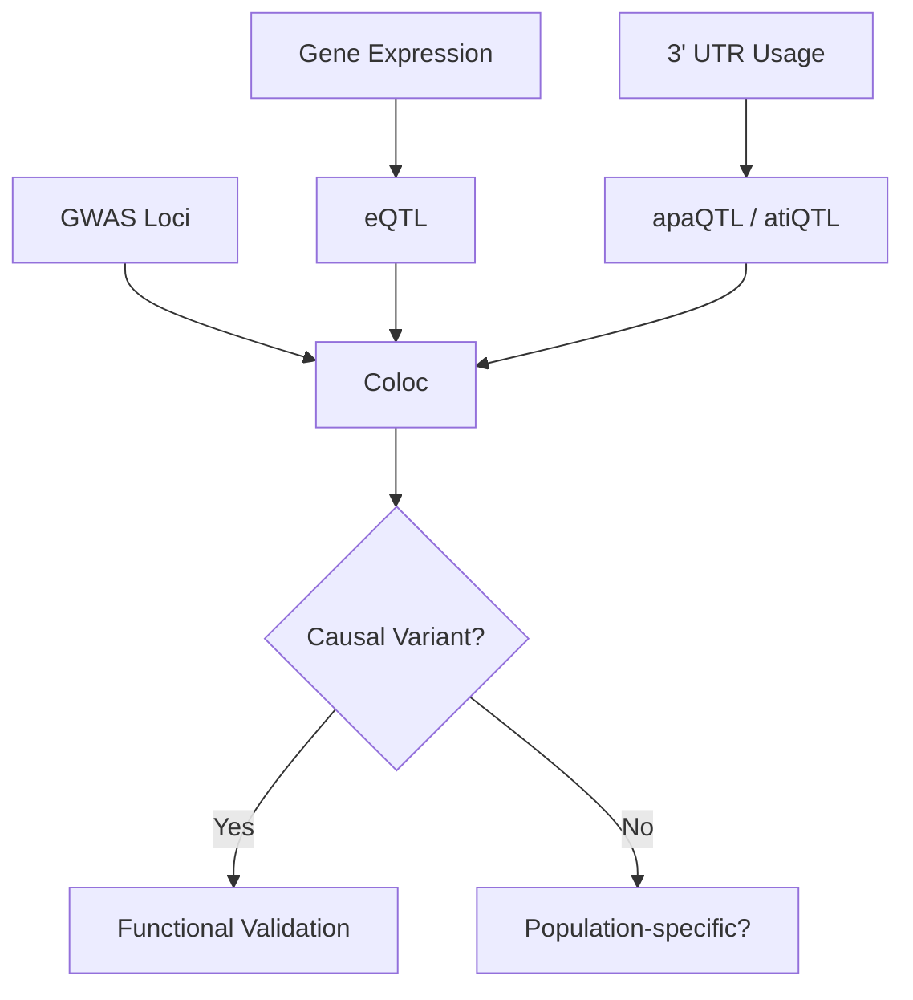

# UTR动态重塑与脑疾病遗传调控

> 从800+个人脑样本里找3' UTR的遗传调控信号，跨三个人群反复确认"这个结果是真的"。

---

## 研究什么

人脑发育和衰老过程中，基因的3' UTR会通过**替代聚腺苷酸化（APA）**发生长度变化——有的变短、有的变长。这些变化影响了mRNA的稳定性、定位和翻译效率。



核心问题：

1. **APA/ATI有没有遗传调控？** ——apaQTL在三个ancestry group（EAS/EUR/AFR）里是否都能检测到？
2. **这些调控信号是否与脑疾病相关？** ——通过coloc和fine-mapping，看QTL信号能不能解释GWAS loci
3. **人群差异怎么处理？** ——不同人群的LD结构、allele frequency差异导致power不同

---

## 全流程自己搓

从raw data到最终结果，整个pipeline都是我搭的：

**基因型**：VCF → joint calling → VQSR → imputation → post-QC → PLINK格式

```bash
# 完整pipeline用Snakemake管理
# config.yaml定义参数，Snakefile定义规则
snakemake --cores 32 --use-singularity
```

imputation试过ChinaMAP和TOPMed，QC三步法（missingness → MAF → HWE）。sex check发现了几个错标样本——这种东西不做不知道，一做吓一跳。

**表达**：RNA-seq → STAR比对 → featureCounts定量 → gene filtering → VST标准化 → ComBat批次校正 → INT

这一步踩的坑最多——五种标准化方法比了一遍才定的，详见[[notes/preprocessing-comparison|五种标准化方法对比实录]]。

**QTL mapping**：TensorQTL做nominal pass → permutation求empirical p-value → 多人群pi1统计量 → 效应量比较 → SuSiE fine-mapping → coloc

---

## 踩过的大坑

### 标准化方法选哪个

TMM、VST、QN、log2CPM、TPM——全跑了一遍。最后选了VST+ComBat。

> 老老实实说，这五种方法我比了一遍，发现"效果差不多但在不同的方面"，然后选了一个"不太会出错"的。科研有时候就是这样。

详见[[notes/preprocessing-comparison|五种标准化方法对比实录]]。

### 批次效应

ComBat、RUV-III、limma removeBatchEffect——每种方法的假设不同，适用场景不同。

我最终用了ComBat修正技术批次 + PEER因子捕捉隐藏混杂。bridge pair的设计帮了大忙——同一个样本跨批次出现，可以直接评估校正效果。

详见[[notes/batch-effect-battle|批次效应求生记]]。

### 跨人群QTL

三个人群的allele frequency差异很大。一个在EUR里common的variant，在EAS里可能很rare，根本没有power去检测关联。

```r
# Population-specific QTL分类
# strict_specific: 只在一个人群显著，其他人群有power但不显著
# uncertain_not_tested: 其他人群MAF太低没法test
# putative_low_power: 其他人群可能只是power不够

classify_qtl <- function(eas_p, eur_p, afr_p, eas_maf, eur_maf, afr_maf) {
  # MAF < 0.01 视为没有power
  # 只有人在有power的前提下不显著，才能说"shared but not significant"
  # ...
}
```

> 能说吗 我真觉得基因根本不显著

但pi1在三个群都>0，shared signal是存在的。

---

## 用的数据

- 脑组织RNA-seq：800+样本，多个脑区
- 基因型：WGS + imputed
- 人群：EAS、EUR、AFR
- GWAS summary statistics for neuropsychiatric traits

---

## 工具一览

| 步骤 | 工具 |
|------|------|
| 比对 | STAR |
| 定量 | featureCounts |
| 基因型QC | PLINK, bcftools, GATK |
| Imputation | beagle, minimac4 (ChinaMAP/TOPMed) |
| 差异分析 | DESeq2, limma |
| 批次校正 | sva (ComBat), RUVSeq |
| QTL mapping | TensorQTL, QTLtools |
| Fine-mapping | SuSiE |
| Coloc | coloc (R package) |
| Pipeline管理 | Snakemake |

---

*这条线还在走，更多结果出来会更新*